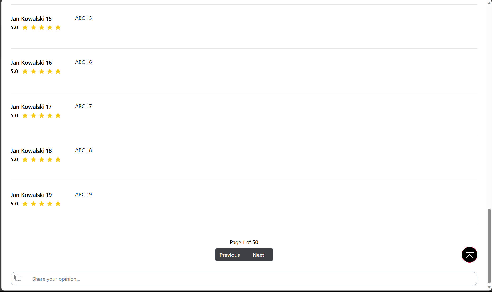

# Opinionsboard Svelte
Is the opinions board component [publicly avaiable on NPM](https://www.npmjs.com/settings/opinions-board/svelte), your customers etc. can use to estimate whatever: user profile, car, bike, photo, product.
Ready out of the box for Svelte

## Is avaiable for commercial?
Yes due to license, you can also buy me a tea

## Download from [npm](https://www.npmjs.com/settings/opinions-board/svelte) <!-- TODO: Add link to repo -->
```bash
$ npm install @opinions-board/svelte
```

## Preview
<details>
    <summary>
        <b>Images</b>
    </summary>
    <div>
        <p>Real word Usecase - Estimation of user profile</p>
        
    </div>
    <div>
        <p>Raw previews</p>
        
        
        
        
    </div>
</details>

# License
Apache 2.0
